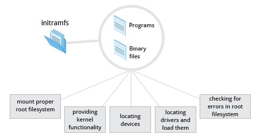

# Initial RAM Disk

The `initramfs` filesystem image contains programs and binary files that perform all actions needed to mount the proper root filesystem, like providing kernel functionality for the needed filesystem and device drivers for mass storage controllers with a facility called udev (for user device), which is responsible for figuring out which devices are present, locating the device drivers they need to operate properly, and loading them. After the root filesystem has been found, it is checked for errors and mounted.

The `mount` program instructs the operating system that a filesystem is ready for use, and associates it with a particular point in the overall hierarchy of the filesystem (the mount point). If this is successful, the `initramfs` is cleared from RAM and the init program on the root filesystem (`/sbin/init`) is executed.

`init` handles the mounting and pivoting over to the final real root filesystem. If special hardware drivers are needed before the mass storage can be accessed, they must be in the `initramfs` image.

* [Text-Mode Login](./text-mode-login.md)

